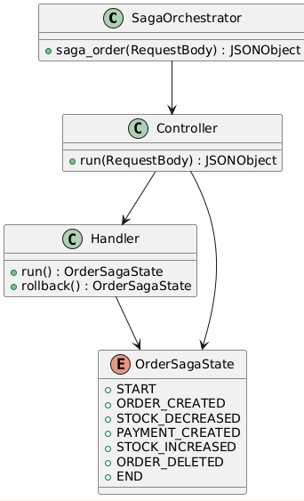
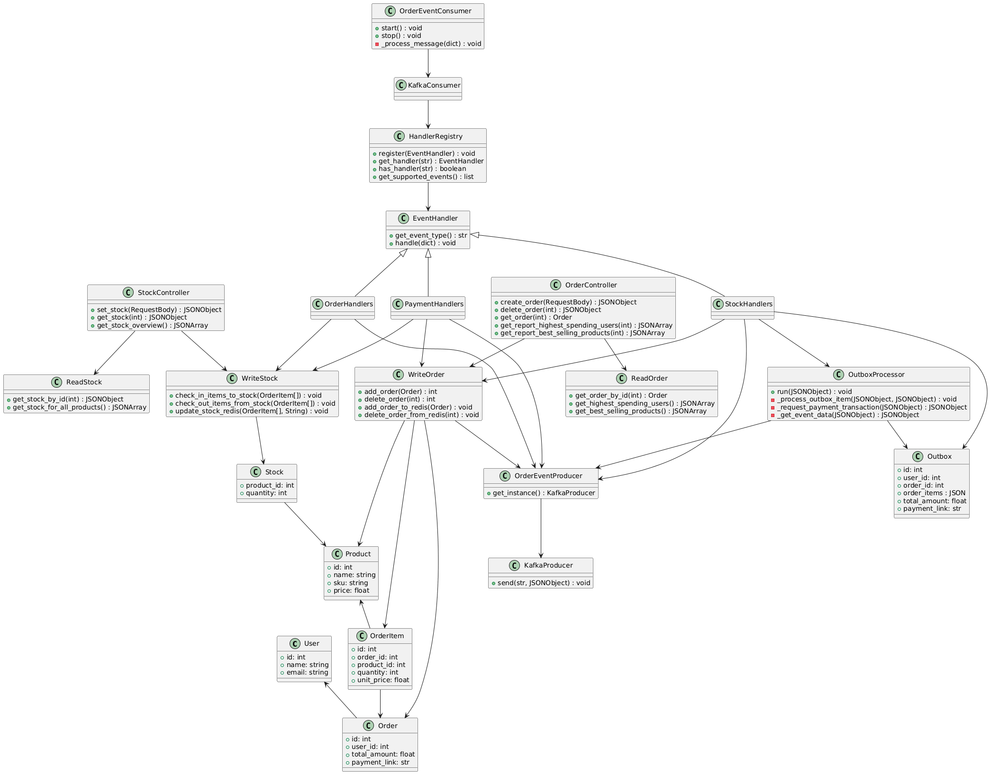
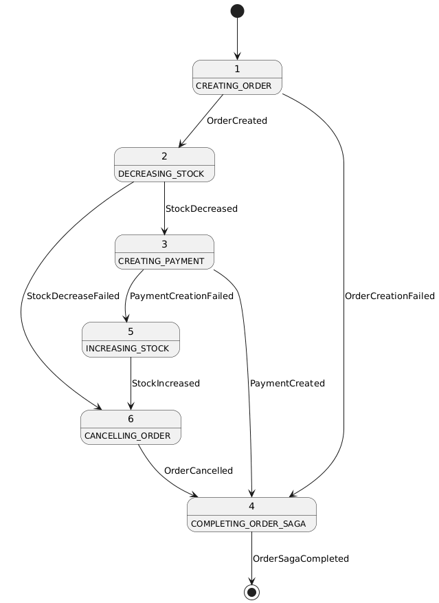
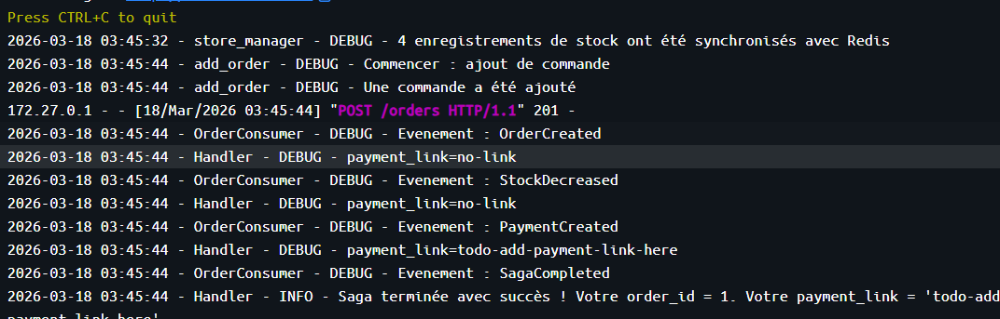
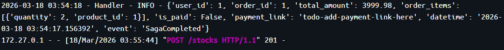

# Laboratoire 8 - Saga chorégraphiée, CQRS avec event broker, patron Outbox 
**Table des matières**
1. Introduction, description des fichiers et définition.
2. Réponse aux question.

## 1. Introduction, description des fichiers et définitions.

### Context et introduction ###
**Veuillez noter que que mon compte GitHub scolaire, celui avec inscrit à l'adresse benjamin.tardif.1@ens.etsmtl.ca n'est pas disponible pour l'instant. Mon compter a été hacké cet été et GitHub m'a bloqué l'accès. Les démarches ont été entreprises pour retrouver les droits d'accès. Conséquemment, le repertoire de GitHUb Classroom a été recopié de manière locale afin de pouvoir produire les demandes de laboratoire.**

Ce laboratoire est le huitième d'une suite de laboratoires donnés dans le cadre du cour LOG430 - architecture logiciel. Il a pour objectif d'apprendre à l'étudiant le fonctionnement d'une SAGA.

### Objectifs du laboratoire ###
Tel que décrit dans l'énoncé du laboratoire. 
* Comprendre le fonctionnement d'une Saga chorégraphiée implémentée dans multiples microservices en utilisant Kafka en tant qu’event broker
* Comprendre la différence entre les patrons Saga orchestrée (labo 6) et chorégraphiée (labo 8)
* Observer comment une architecture event-driven travaille ensemble avec les concepts CQRS
* Utiliser le patron Outbox pour augmenter la tolérance aux pannes dans une application
* Implémenter des event handlers qui réagissent aux événements et déclenchent des actions compensatoires


### Definitions et principes ###
* 

## 2. Réponses au questions
**Question 1 : Comment on faisait pour passer d'un état à l'autre dans la saga dans le labo 6, et comment on le fait ici? Est-ce que le contrôle de transition est fait par le même structure dans le code? Illustrez votre réponse avec des captures d'écran ou extraits de code.**

Similairement au laboratoire 6, le laboratoire 8 tient à implémenter une Saga par laquelle un processus est traité par état. Toutefois, des différences fondamentales dans l'architecture de leur implémentation sont à souligner. Dans le cas du laboratoire 6, le changement d'état se fait de manière séquentielle à même le code. Un orchestarteur s'assure de changer et d'exécuter les états :

```
    def run(self, request):
        """ Perform steps of order saga """
        payload = request.get_json() or {}
        order_data = {
            "user_id": payload.get('user_id'),
            "items": payload.get('items', [])
        }
        self.create_order_handler = CreateOrderHandler(order_data)

        # Si la saga n'est pas terminée, répétez cette boucle
        while self.current_saga_state is not OrderSagaState.END:
            if self.current_saga_state == OrderSagaState.START:
                self.logger.debug("État initial")
                self.current_saga_state = self.create_order_handler.run()
            elif self.current_saga_state == OrderSagaState.ORDER_CREATED:
                self.decrease_stock_handler = DecreaseStockHandler(self.create_order_handler.order_id, order_data['items'])
                self.current_saga_state = self.decrease_stock_handler.run()
            elif self.current_saga_state == OrderSagaState.STOCK_DECREASED:
                self.create_payment_handler = CreatePaymentHandler(self.create_order_handler.order_id, order_data)
                self.current_saga_state = self.create_payment_handler.run()
            elif self.current_saga_state == OrderSagaState.STOCK_INCREASED:
                self.delete_order_handler = DeleteOrderHandler(self.create_order_handler.order_id, order_data)
                self.current_saga_state = OrderSagaState.ORDER_DELETED
            elif self.current_saga_state is OrderSagaState.PAYMENT_CREATED or self.current_saga_state is OrderSagaState.ORDER_DELETED:
                self.logger.debug("Transition à l'état terminal")
                self.current_saga_state = OrderSagaState.END
            else:
                self.is_error_occurred = True
                self.logger.debug(f"L'état de la commande n'est pas valide : {self.current_saga_state}")
                self.current_saga_state = OrderSagaState.END

        return {
            "order_id": self.create_order_handler.order_id,
            "status":  "Une erreur s'est produite lors de la création de la commande." if self.is_error_occurred else "OK"
        }
```

Les états sont ensuite ajustés dans les services de cette manière : 

```
    def run(self):
        """Call StoreManager to create order"""
        try:
            # ATTENTION: Si vous exécutez ce code dans Docker, n'utilisez pas localhost. Utilisez plutôt le hostname de votre API Gateway
            response = requests.post(f'{config.API_GATEWAY_URL}/store-manager-api/orders',
                json=self.order_data,
                headers={'Content-Type': 'application/json'}
            )
            if response.ok:
                data = response.json() 
                self.order_id = data['order_id'] if data else 0
                self.logger.debug("Transition d'état: CreateOrder -> ORDER_CREATED")
                return OrderSagaState.ORDER_CREATED
            else:
                text = response.json() 
                self.logger.error(f"CreateOrder a échoué : {response.status_code} - {text}")
                return OrderSagaState.END
```

Veuillez noter la ligne juste avant le else où le statut de la saga est altéré. Une fois cette modification apportée l'orchestrateur traite le changement avec le code qui lui est attribué. Cette logique est très différente de la logique implementée dans le laboratoire présent.   

Voici le diagramme de classe présentée dans le laboratoire 6: 



Voici le diagramme de classe présentée dans le laboratoire 8:



Comme on peut le voir dans le nouveau diagramme, l'architecture est maintenant beaucoup plus élaborée et dépend d'évènements. Contrairement à l'élaboration du laboratoire 6, ces évènements sont traités par des handlers. Ces handlers recoivent les évènements afin d'en traiter la source et sont programmés de cette manière : 

```
class EventHandler(ABC):
    """Base class for all event handlers"""

    def __init__(self):
        """ Constructor method """
        self.logger = Logger.get_instance('Handler')
    
    @abstractmethod
    def handle(self, event_data: Dict[str, Any]) -> None:
        """Process the event data"""
        pass
    
    @abstractmethod
    def get_event_type(self) -> str:
        """Return the event type this handler processes"""
        pass
```

```
class OrderCancelledHandler(EventHandler):
    """Handles OrderCancelled events"""
    
    def __init__(self):
        self.order_producer = OrderEventProducer()
        super().__init__()
    
    def get_event_type(self) -> str:
        """Get event type name"""
        return "OrderCancelled"
    
    def handle(self, event_data: Dict[str, Any]) -> None:
        """Execute every time the event is published"""
        # La commande a été annullé, il n'y a donc rien d'autre à faire. Déclenchez l'événement SagaCompleted.
        event_data['event'] = "SagaCompleted"
        OrderEventProducer().get_instance().send(config.KAFKA_TOPIC, value=event_data)

```

Le classe EventHandler est passée en argument dans les eventHandler concrets passe la logique à leur tour. Dans l'exemple démontré par le code ci-dessus, le handler contrôle la logique de la saga en plus d'une changer l'état de celle-ci. Cette manière d'implémenter les choses facilite le découplage entre les entités et permet l'ajustement des méthodes sans affecter le reste du système. 

**Question 2 : Sur la relation entre nos Handlers et le patron CQRS : pensez-vous qu'ils utilisent plus souvent les Commands ou les Queries? Est-ce qu'on tient l'état des Queries à jour par rapport aux changements d'état causés par les Commands? Illustrez votre réponse avec des captures d'écran ou extraits de code.**

Pour répondre à cette question il est pertinent de montrer le state machine qui démontre les états utilisées par le système :  



Dans le cas des états ci-dessus, considérant le mouvement avant des états, intuitivement je dirais qu'il y a plus de commandes que de queries. Toutefois, il est important de comprendre qu'en architecture évènementielle, une commande ne peut arriver sans une query. On déclenche un évènement qui propage de l'information et par le fait même les eventhandlers utilisent les commandes pour faire des queries. Le nombre des deux entités devraient se balancer. 
___
2. Observez le service en action  


___

3. Implémentez les Handlers de stock


___

4. Préparez le Payments API à recevoir des événements
